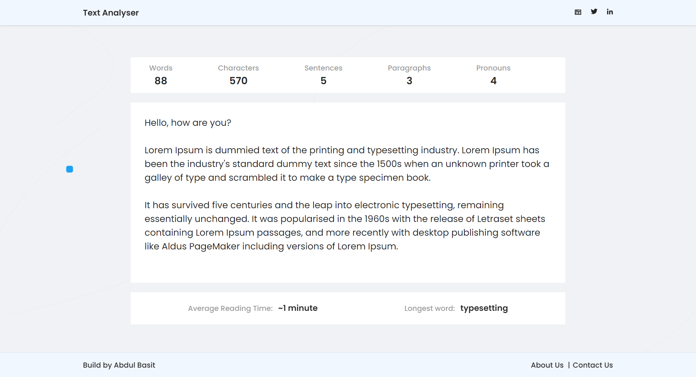

# View Live Project at: https://text-analyzer-tool-lime.vercel.app/

This project is made based of codevertiser's react challenges.
challange description: https://www.codevertiser.com/reactjs-challenge-1-text-analyzer-tool/

we have created a text area that calculates some parameters in the typed or pasted Text. The text area calculates and shows the following:

    1. Words
    2. Characters
    3. Sentences
    4. Paragraphs
    5. Average reading time
    6. The longest word in paragraphs
    7. Number of pronouns in the Text (list is given)
